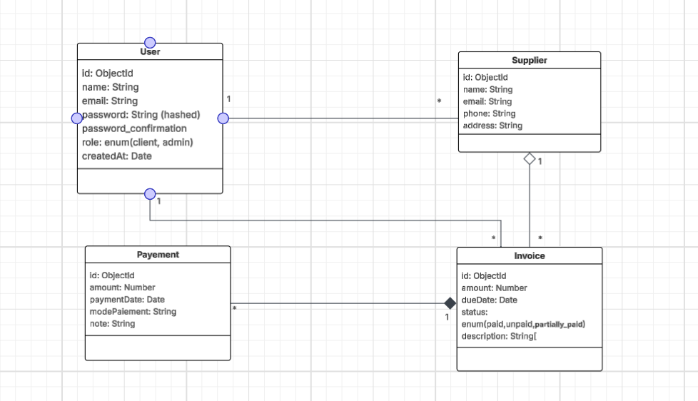
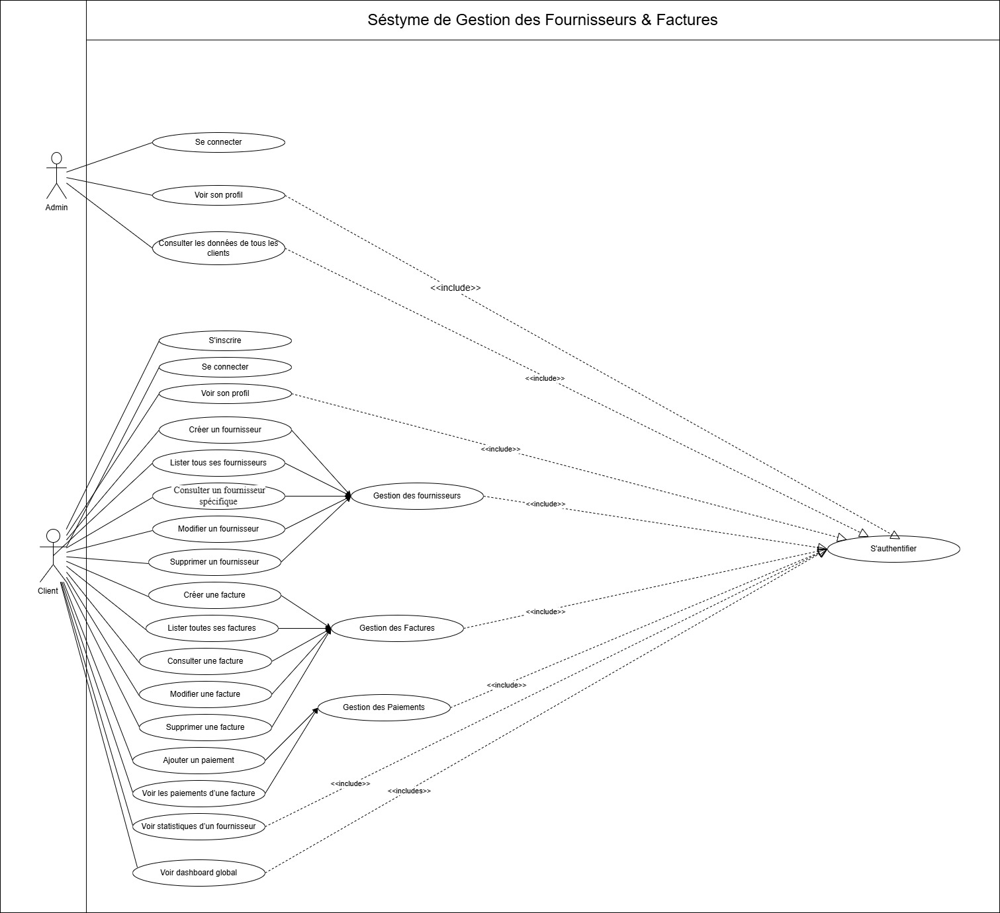

# brief_jury_blanc — Supplier & Invoice Management API

A RESTful backend API built with **Node.js**, **Express**, and **MongoDB** for managing suppliers, invoices, and payments, with JWT-based authentication and role-based access control.

---

## Features

- **Authentication** — Register, login, and secure routes using JWT tokens with bcrypt password hashing
- **Supplier Management** — Full CRUD operations on supplier records
- **Invoice Management** — Full CRUD operations on invoices linked to suppliers
- **Payment Operations** — Create and track payments associated with invoices
- **Analytics** — Aggregated reporting and financial analytics endpoints
- **Validation** — Request validation using `express-validator`
- **UML Documentation** — Class diagram and use case diagram included in `src/digrammes/`

---

## Tech Stack

| Layer       | Technology               |
| ----------- | ------------------------ |
| Runtime     | Node.js (ES Modules)     |
| Framework   | Express 5                |
| Database    | MongoDB + Mongoose 9     |
| Auth        | JSON Web Tokens + bcrypt |
| Validation  | express-validator        |
| Dev tooling | nodemon                  |

---

## Project Structure

```
src/
├── config/
│   └── db.js                   # MongoDB connection setup
├── controllers/
│   ├── auth.controller.js      # Handles login & registration logic
│   ├── invoice.controller.js   # Invoice CRUD handlers
│   ├── payment.controller.js   # Payment operation handlers
│   └── supplier.controller.js  # Supplier CRUD handlers
├── digrammes/
│   ├── class.png               # UML class diagram
│   └── useCase.jpg             # UML use case diagram
├── middlewares/
│   ├── auth.middleware.js      # JWT verification & route protection
│   └── validation.middleware.js# Request body validation rules
├── models/
│   ├── invoice.model.js        # Invoice Mongoose schema
│   ├── payment.model.js        # Payment Mongoose schema
│   ├── supplier.model.js       # Supplier Mongoose schema
│   └── user.model.js           # User Mongoose schema
├── routes/
│   ├── auth.route.js           # POST /api/auth/*
│   ├── invoice.route.js        # CRUD /api/invoices/*
│   ├── payment.route.js        # /api/payments/*
│   └── supplier.route.js       # CRUD /api/suppliers/*
├── services/
│   ├── auth.service.js         # Authentication business logic
│   ├── invoice.service.js      # Invoice business logic
│   ├── password.service.js     # Password hashing/comparison
│   ├── payment.service.js      # Payment business logic
│   ├── supplier.service.js     # Supplier business logic
│   └── token.service.js        # JWT generation & verification
├── .gitignore
├── package.json
└── server.js                   # App entry point
```

---

## Getting Started

### Prerequisites

- Node.js v18+
- MongoDB (local or Atlas)

### Installation

```bash
# Clone the repository
git clone https://github.com/your-username/brief_jury_blanc.git
cd brief_jury_blanc/src

# Install dependencies
npm install
```

### Environment Variables

Create a `.env` file in the `src/` directory:

```env
PORT=3000
MONGO_URI=mongodb://localhost:27017/brief_jury_blanc
JWT_SECRET=your_jwt_secret_key
JWT_EXPIRES_IN=7d
```

### Running the Server

```bash
# Development (with auto-reload)
npm run dev

# Production
node server.js
```

The server will start at `http://localhost:3000`.

---

## API Endpoints

### Auth

| Method | Endpoint             | Description         | Protected |
| ------ | -------------------- | ------------------- | --------- |
| POST   | `/api/auth/register` | Register a new user | No        |
| POST   | `/api/auth/login`    | Login & receive JWT | No        |
| POST   | `/api/auth/me`       | Login & receive JWT | No        |

### Suppliers

| Method | Endpoint             | Description          | Protected |
| ------ | -------------------- | -------------------- | --------- |
| GET    | `/api/suppliers`     | List all suppliers   | Yes       |
| GET    | `/api/suppliers/:id` | Get a supplier by ID | Yes       |
| POST   | `/api/suppliers`     | Create a supplier    | Yes       |
| PUT    | `/api/suppliers/:id` | Update a supplier    | Yes       |
| DELETE | `/api/suppliers/:id` | Delete a supplier    | Yes       |

### Invoices

| Method | Endpoint            | Description          | Protected |
| ------ | ------------------- | -------------------- | --------- |
| GET    | `/api/invoices`     | List all invoices    | Yes       |
| GET    | `/api/invoices/:id` | Get an invoice by ID | Yes       |
| POST   | `/api/invoices`     | Create an invoice    | Yes       |
| PUT    | `/api/invoices/:id` | Update an invoice    | Yes       |
| DELETE | `/api/invoices/:id` | Delete an invoice    | Yes       |

### Payments

| Method | Endpoint            | Description         | Protected |
| ------ | ------------------- | ------------------- | --------- |
| GET    | `/api/payments`     | List all payments   | Yes       |
| GET    | `/api/payments/:id` | Get a payment by ID | Yes       |
| POST   | `/api/payments`     | Register a payment  | Yes       |

> Protected routes require an `Authorization: Bearer <token>` header.

---

## UML Diagrams

Design diagrams are located in `src/digrammes/`:

- **`class.png`** — Entity class diagram showing model relationships
- **`useCase.jpg`** — Use case diagram illustrating system actor interactions




---

## Dependencies

```json
{
  "bcrypt": "^6.0.0",
  "dotenv": "^17.4.1",
  "express": "^5.2.1",
  "express-validator": "^7.3.2",
  "jsonwebtoken": "^9.0.3",
  "mongoose": "^9.4.1"
}
```

---

## License

ISC
